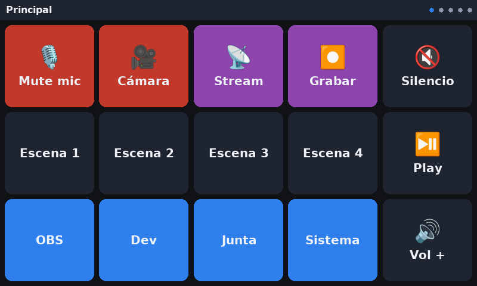
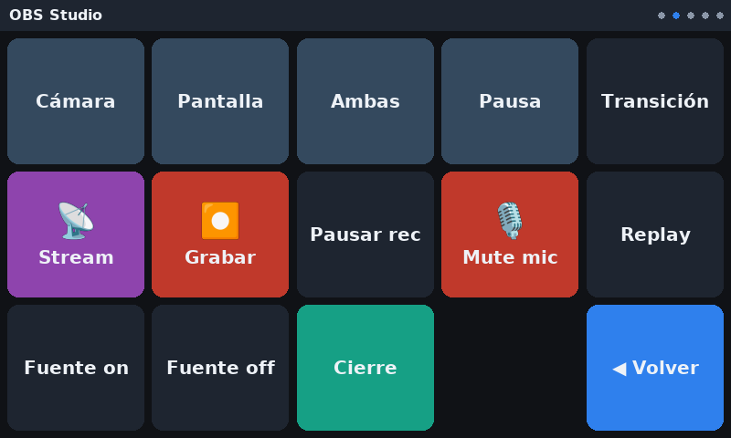

# PiDeck

Convierte una Raspberry Pi 4 con la pantalla táctil oficial de 7" en un Stream
Deck. La Pi se conecta a tu computadora por un solo cable USB-C y **se hace
pasar por un teclado**: cuando tocas un botón en la pantalla, la PC recibe una
combinación de teclas normal y corriente.

No instalas nada en la computadora. No hay servidor, ni red, ni emparejamiento,
ni latencia. Funciona igual en Windows, macOS y Linux porque los tres traen el
driver de teclado USB de fábrica.



## Cómo funciona

La Pi 4 puede operar su puerto USB-C en modo periférico (*USB gadget*). El
script `scripts/usb-gadget-up.sh` usa `configfs` para declarar dos dispositivos
HID:

| Dispositivo | Tamaño de reporte | Para qué sirve |
| --- | --- | --- |
| `/dev/hidg0` | 8 bytes | Teclado *boot protocol*: modificadores + hasta 6 teclas |
| `/dev/hidg1` | 2 bytes | *Consumer control*: volumen, play/pausa, siguiente |

Escribir en esos archivos **es** enviar una pulsación. La interfaz táctil
(`src/pideck/ui.py`) dibuja la rejilla con pygame y traduce cada toque en la
escritura correspondiente.

La UI corre sobre KMS/DRM directamente, sin escritorio: puedes instalarla sobre
Raspberry Pi OS Lite y el arranque hasta tener botones útiles toma unos
segundos. Nada más se ejecuta que pueda robarle el foco.

## Hardware

- Raspberry Pi 4 (el modo periférico del puerto USB-C es exclusivo de la 4 y la 5)
- Pantalla táctil oficial de 7" (800×480, DSI)
- Un cable USB-C **de datos**, no de solo carga
- Alimentación por los pines 5V del GPIO o un HAT PoE — ver la advertencia abajo

## Alimentación: léelo antes de conectar nada

Cuando el puerto USB-C entra en modo periférico deja de ser tu entrada de
corriente confiable. Un puerto USB de PC no le va a dar a una Pi 4 con pantalla
los hasta 3 A que puede pedir, y el síntoma son reinicios aleatorios que parecen
un bug de software.

Alimenta la Pi por los pines 5V/GND del GPIO con una fuente de 3 A o más, o con
un HAT PoE, y deja el USB-C exclusivamente para datos.

## Instalación

```bash
git clone https://github.com/oscarolar/agents-oscarolar
cd agents-oscarolar/projects/pideck
sudo ./install.sh
sudo reboot
```

El instalador es idempotente y hace lo siguiente:

1. Instala `python3-yaml` y `python3-pygame`.
2. Agrega `dtoverlay=dwc2,dr_mode=peripheral` a `config.txt` si falta.
3. Copia el código a `/opt/pideck` y la configuración a `/etc/pideck/deck.yaml`.
4. Instala reglas de udev para que el servicio llegue a `/dev/hidg*` y al brillo
   sin correr como root.
5. Instala y habilita `pideck-gadget.service` y `pideck.service`.

Si ya existe `/etc/pideck/deck.yaml`, no lo toca: deja el archivo nuevo como
`deck.yaml.example`.

Tras el reinicio, conecta el USB-C de la Pi a la computadora. Debería aparecer
como un teclado llamado *PiDeck Macro Keyboard*.

## Configuración

Todo vive en `/etc/pideck/deck.yaml`. Después de editarlo:

```bash
sudo python3 -m pideck --config /etc/pideck/deck.yaml --check
sudo systemctl restart pideck
```

El `--check` valida cada botón, incluidas las combinaciones de teclas. Un nombre
mal escrito falla en la consola con un mensaje claro, en vez de convertirse en
un botón que no hace nada justo cuando lo necesitas.

### Estructura

```yaml
deck:
  columns: 5
  rows: 3
  start_page: main
  idle:
    dim_after_seconds: 180
    dim_level: 12

pages:
  - id: main
    name: Principal
    buttons:
      - label: "Mute"
        icon: "🎙"
        color: "#c0392b"
        action: {type: key, keys: "ctrl+shift+m"}
```

Los botones se acomodan solos de izquierda a derecha. Si quieres fijar uno,
agrégale `position: [fila, columna]` con índices desde cero.

El `icon` acepta un emoji o la ruta a un PNG. Los emoji dependen de que la
imagen traiga `fonts-noto-color-emoji`; los PNG siempre funcionan.

### Tipos de acción

| Tipo | Ejemplo | Qué hace |
| --- | --- | --- |
| `key` | `{type: key, keys: "ctrl+shift+m"}` | Manda una combinación. Acepta `repeat: N` |
| `text` | `{type: text, text: "git status\n"}` | Teclea una cadena carácter por carácter |
| `media` | `{type: media, key: play_pause}` | Tecla multimedia por *consumer control* |
| `sequence` | ver abajo | Encadena pasos con esperas |
| `page` | `{type: page, page: obs}` | Cambia de página en la propia Pi |
| `brightness` | `{type: brightness, delta: -15}` | Ajusta el brillo del panel de la Pi |
| `shell` | `{type: shell, command: "systemctl reboot"}` | Corre un comando **en la Pi**, no en la PC |
| `none` | `{type: none}` | Botón decorativo |

Una secuencia encadena pasos, cada uno un mapeo de una sola entrada:

```yaml
action:
  type: sequence
  steps:
    - key: "f16"       # corta a la escena de cierre
    - delay: 3         # aguanta tres segundos
    - key: "f17"       # detiene el stream
```

Sobre `shell`: el comando se parte con `shlex` y se ejecuta **sin** shell, así
que unas comillas en una etiqueta no se convierten en una inyección. Corre como
el usuario del servicio, no como root; si necesitas algo privilegiado, agrega
una regla puntual en `sudoers` y llama `sudo -n`.

### Nombres de teclas

```bash
python3 -m pideck --list-keys
```

Modificadores: `ctrl`, `shift`, `alt`, `gui` (también `win`, `cmd`, `super`) y
sus variantes izquierda/derecha (`lctrl`, `rshift`, `altgr`, …).

**Usa F13–F24 cuando puedas.** Prácticamente ninguna aplicación las tiene
asignadas por defecto, así que nunca chocan con un atajo existente. Es
exactamente para lo que sirven en un macro pad: las asignas una vez en OBS bajo
*Settings → Hotkeys* y ya son tuyas para siempre.

### Sobre el teclado y los acentos

El teclado HID manda *posiciones de tecla*, no caracteres. La acción `text`
asume distribución US: los caracteres fuera de esa distribución (`ñ`, acentos,
`€`) se omiten con una advertencia en el log en vez de teclear algo incorrecto.
Para esos casos usa `key` con la tecla física que corresponda a tu distribución.

## Páginas incluidas

La configuración de ejemplo trae cinco páginas de 15 botones:

- **Principal** — lo más usado de todo, más los accesos a las demás páginas
- **OBS Studio** — escenas, stream, grabación, mute, y una secuencia de cierre
- **Dev / Terminal** — atajos de VS Code y comandos que se teclean solos
- **Juntas** — mute y cámara para Google Meet, Zoom y Teams
- **Sistema** — multimedia, volumen, bloqueo y brillo del panel de la Pi



Los botones de OBS mandan F13–F24 y **no hacen nada hasta que los asignes** en
OBS. Es a propósito, por lo explicado arriba.

Además de los botones de página, puedes deslizar el dedo horizontalmente para
cambiar de página.

## Desarrollo

Se puede trabajar en la interfaz desde cualquier máquina, sin Pi y sin gadget:

```bash
cd projects/pideck
PYTHONPATH=src python3 -m pideck --config config/deck.yaml --windowed --dry-run
```

Con `--dry-run` los reportes HID se escriben al log en vez de al dispositivo,
así ves exactamente qué bytes se hubieran enviado.

Las pruebas no dependen de nada fuera de la librería estándar:

```bash
python3 -m unittest discover -s tests -v
```

Cubren la resolución de teclas, los bytes exactos de cada reporte, la validación
de la configuración y que todas las páginas del `deck.yaml` incluido sean
alcanzables desde la de inicio.

## Solución de problemas

**La computadora no ve ningún teclado.** Revisa que el cable sea de datos —
es la causa más común con diferencia. Luego confirma el gadget:

```bash
systemctl status pideck-gadget
ls /sys/class/udc          # debe listar algo como fe980000.usb
cat /sys/kernel/config/usb_gadget/pideck/UDC
```

Si `/sys/class/udc` sale vacío, el overlay `dwc2` no se cargó: verifica la línea
en `config.txt` y reinicia.

**La Pi se reinicia sola al tocar botones.** Es alimentación. Ver la advertencia
de arriba.

**Los botones no responden pero la pantalla dibuja bien.** Casi siempre son
permisos sobre los nodos HID:

```bash
ls -l /dev/hidg*           # debe ser group input, modo 0660
groups                     # tu usuario debe estar en input
journalctl -u pideck -n 50
```

Los grupos nuevos solo aplican tras cerrar sesión o reiniciar.

**El táctil está invertido o girado.** La rotación de la pantalla y la del
táctil son ajustes distintos y hay que cambiar ambos. En Raspberry Pi OS actual
(Wayland) la pantalla se rota con `wlr-randr`, no con el viejo `lcd_rotate` de
`config.txt`. Corriendo sin escritorio, rota el panel con el parámetro de kernel
`video=DSI-1:800x480@60,rotate=180` y el táctil con una regla de udev que fije
`LIBINPUT_CALIBRATION_MATRIX`.

**El brillo no cambia.** El nombre del dispositivo cambió entre kernels
(`rpi_backlight` antes, `10-0045` ahora). El código lo descubre solo, pero
necesita permiso de escritura:

```bash
ls /sys/class/backlight/
ls -l /sys/class/backlight/*/brightness
```

## Limitaciones

- **Es unidireccional.** El teclado manda, no recibe. Los botones no pueden
  reflejar el estado real de OBS ni encenderse cuando estás al aire. Si quieres
  ese feedback, necesitas Bitfocus Companion por red en vez de este enfoque.
- **Los atajos son de la aplicación en foco.** Un botón de "mute de Zoom" solo
  funciona con Zoom al frente, igual que el atajo real. Zoom tiene una opción de
  atajo global; Meet y Teams no.
- **La distribución es US.** Ver la nota sobre acentos.
- **El puerto USB-C queda ocupado.** Ese es el trato del enfoque por cable.

## Licencia

MIT, igual que el resto del repositorio.
